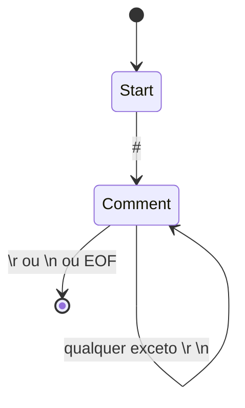
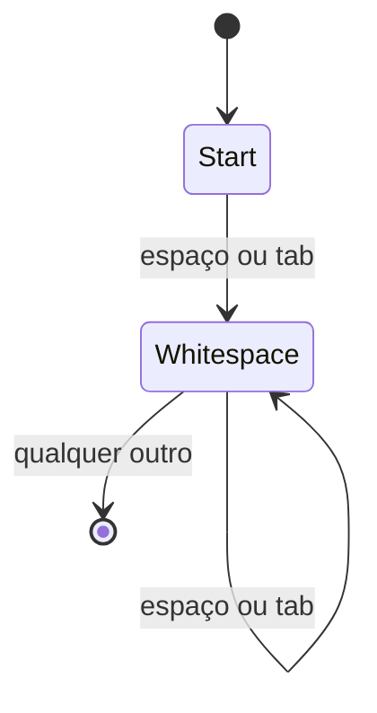
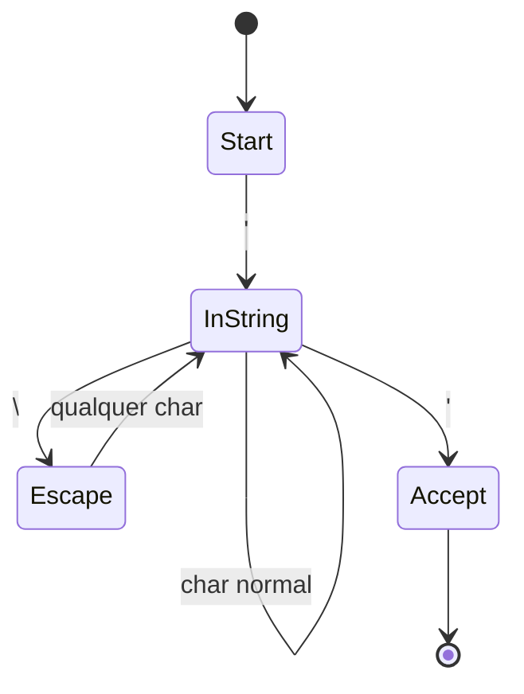
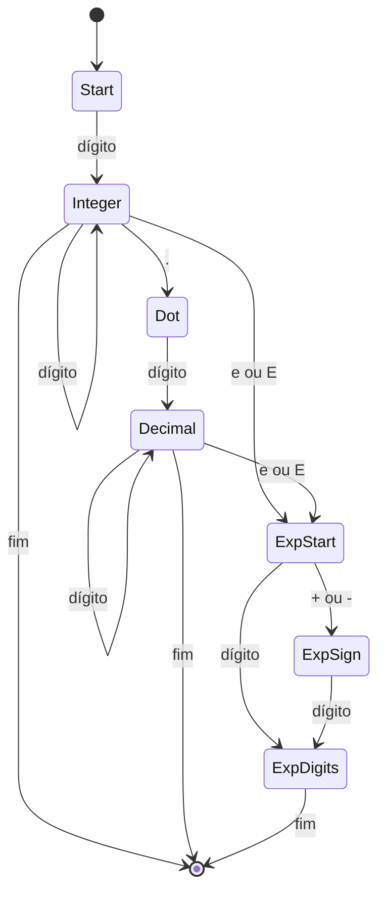
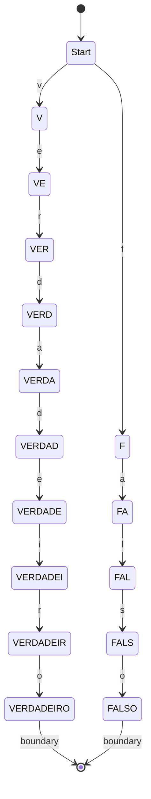
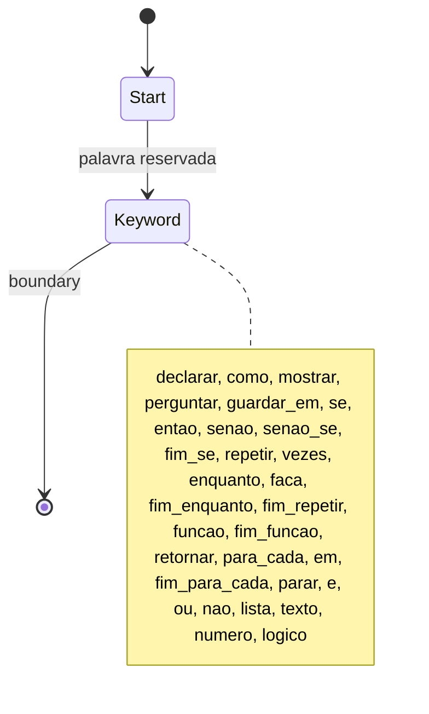
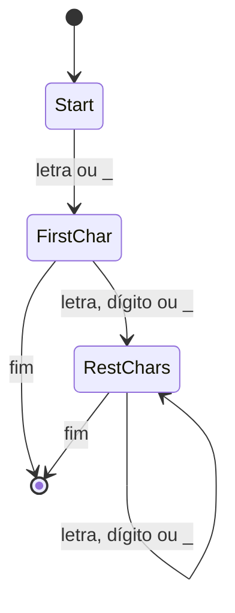
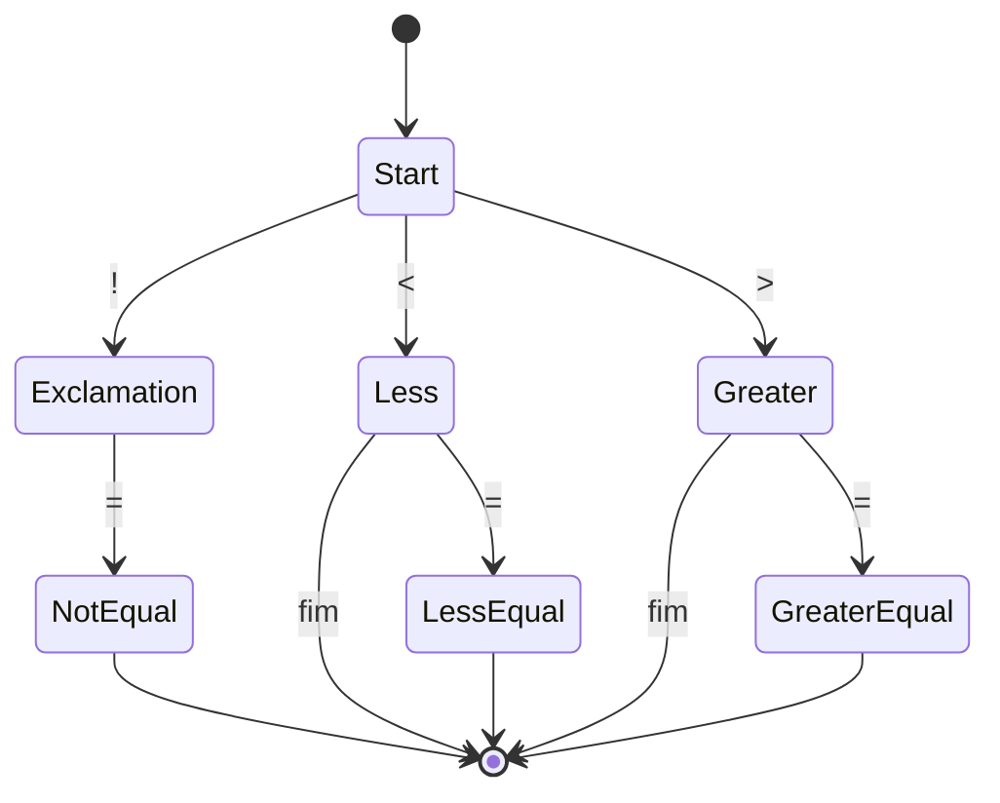
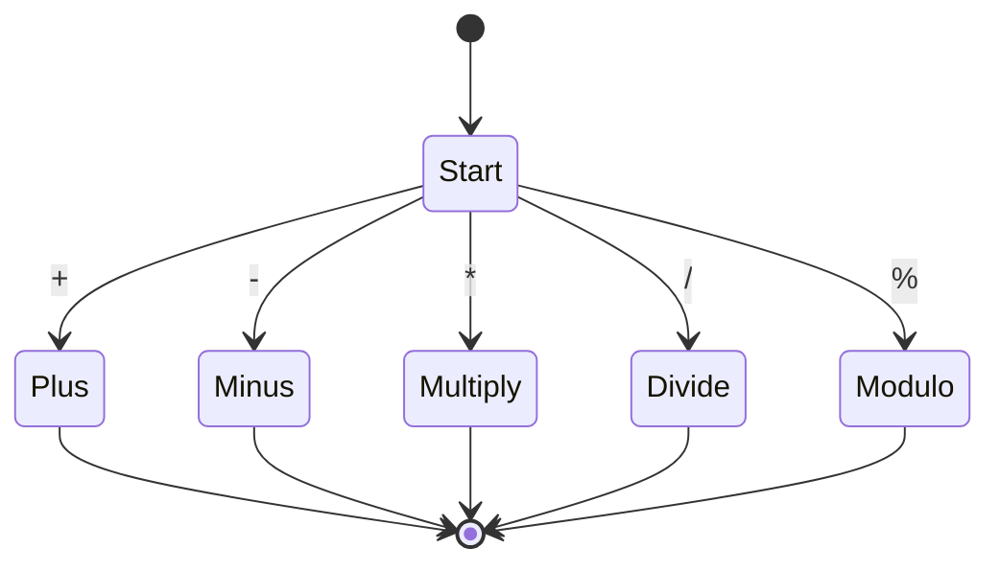
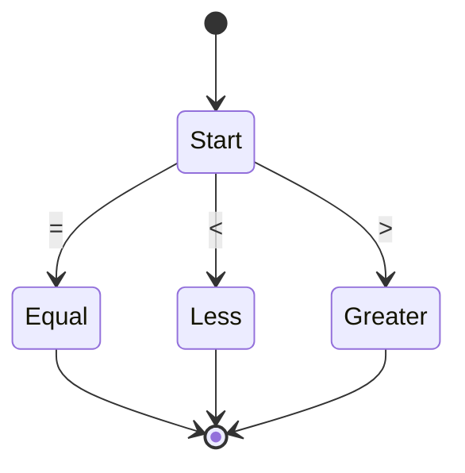

# Autômatos Finitos (Mermaid) — BrasilScript Lexer

Este documento contém diagramas Mermaid dos autômatos finitos determinísticos (DFAs) que correspondem aos principais padrões de tokens do lexer BrasilScript (`Semana 5/lexer.py`).

Os diagramas foram construídos baseados nas expressões regulares reais usadas no código do lexer e seguem a ordem de prioridade definida em `token_specification`.

---

## 1. Comentários e Espaços em Branco

### Comentário: `#[^\r\n]*`



### Espaço em Branco: `[ \t]+`



## 2. Literais de String

### String com Aspas Duplas: `"(?:[^"\\]|\\.)*"`


### String com Aspas Simples: `'(?:[^'\\]|\\.)*'`



## 3. Números

### Número Literal: `\d+(?:\.\d+)?(?:[eE][+-]?\d+)?`



## 4. Literais Lógicos

### Booleanos: `\b(?:verdadeiro|falso)\b`



## 5. Palavras-Chave

### Keywords: Lista completa das palavras reservadas



## 6. Identificadores

### Identificador: `[a-zA-Z_][a-zA-Z0-9_]*`



---

## 7. Operadores

### Operadores Relacionais Multi-char: `!=|<=|>=`



### Operadores Aritméticos: `[+\-*/%]`



### Operadores Relacionais Single-char: `=|<|>`



## 8. Delimitadores

### Parênteses: `\(` e `\)`

```mermaid
stateDiagram-v2
    [*] --> Start
    Start --> LParen : (
    Start --> RParen : )
    LParen --> [*]
    RParen --> [*]

stateDiagram-v2
    [*] --> Start
    Start --> LBracket : [

### Chaves: `\{` e `\}`

```mermaid
stateDiagram-v2
    [*] --> Start
    Start --> LBrace : {
    Start --> RBrace : }
    LBrace --> [*]
    RBrace --> [*]
```

### Outros Delimitadores: `,|;|:|\.`

```mermaid
stateDiagram-v2
    [*] --> Start
    Start --> Comma : ,
    Start --> Semicolon : ;
    Start --> Colon : :
    Start --> Dot : .
    Comma --> [*]
    Semicolon --> [*]
    Colon --> [*]
    Dot --> [*]
```

## Ordem de Prioridade no Lexer

O lexer processa os padrões na seguinte ordem (conforme `token_specification` em `lexer.py`):

1. **COMMENT** - Comentários (`#[^\r\n]*`)
2. **WHITESPACE** - Espaços e tabs (`[ \t]+`)
3. **STRING_LITERAL** - Strings com aspas (`"..."` ou `'...'`)
4. **NUMERO_LITERAL** - Números (`\d+...`)
5. **LOGICO_LITERAL** - Booleanos (`verdadeiro|falso`)
6. **KW** - Palavras-chave (lista completa)
7. **OP_RELACIONAL** (multi-char) - `!=`, `<=`, `>=`
8. **OP_ARITMETICO** - `+`, `-`, `*`, `/`, `%`
9. **OP_RELACIONAL** (single-char) - `=`, `<`, `>`
10. **Delimitadores** - `()`, `[]`, `{}`, `,`, `;`, `:`, `.`
11. **IDENTIFICADOR** - Identificadores (`[a-zA-Z_][a-zA-Z0-9_]*`)
12. **MISMATCH** - Caracteres não reconhecidos (`.`)

Esta ordem garante que:

- Palavras-chave sejam reconhecidas antes de identificadores
- Operadores multi-caractere sejam reconhecidos antes de single-char
- Strings e números tenham prioridade sobre outros padrões

---

## Notas de Implementação

- Tokens `WHITESPACE` e `COMMENT` são **ignorados** pelo lexer (não retornados)
- Tokens `MISMATCH` geram `LexerError`
- O lexer normaliza tipos: `KW` → `PALAVRA_CHAVE`, `OP_*` → `OP`
- Quebras de linha em tokens são tratadas para contagem correta de posição

## Minimização de AFD (Semana 5 extras)

Implementamos uma versão didática do algoritmo de minimização de AFD (Hopcroft) em `Semana 5/afds/minimization.py`.

- Exemplos: `Semana 5/afds/example_dfas.py` contém DFAs simples (identificador e número) usados para demonstração.
- Testes: `Semana 5/test_minimization.py` demonstra que a minimização preserva a linguagem de entrada e normalmente reduz o número de estados.

Observação: a implementação é intencionalmente simples e usa representações em dicionários; para produção, converta para representações mais compactas e otimizadas.
