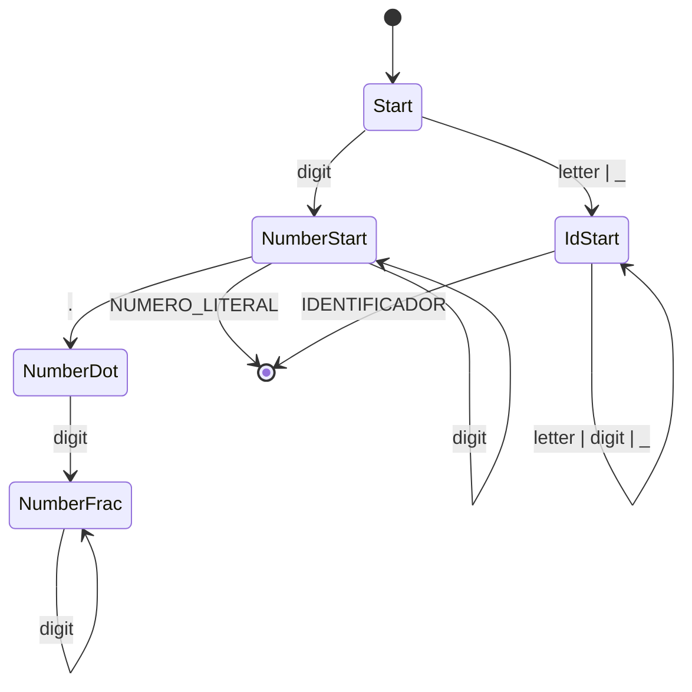

# AFD final (Semana 6)

```mermaid
stateDiagram-v2
    [*] --> Start
    Start --> NumberStart : digit
    NumberStart --> NumberStart : digit
    NumberStart --> NumberDot : .
    NumberDot --> NumberFrac : digit
    NumberFrac --> NumberFrac : digit
    NumberStart --> [*] : NUMERO_LITERAL

    Start --> IdStart : letter | _
    IdStart --> IdStart : letter | digit | _
    IdStart --> [*] : IDENTIFICADOR
```

O arquivo `Semana 6/lexer.py` demonstra a construção automática do DFA a partir do AFN (subset construction) e a utilização do DFA em uma tabela simples para tokenização.
